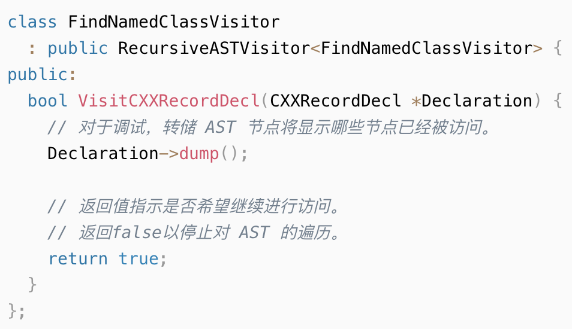
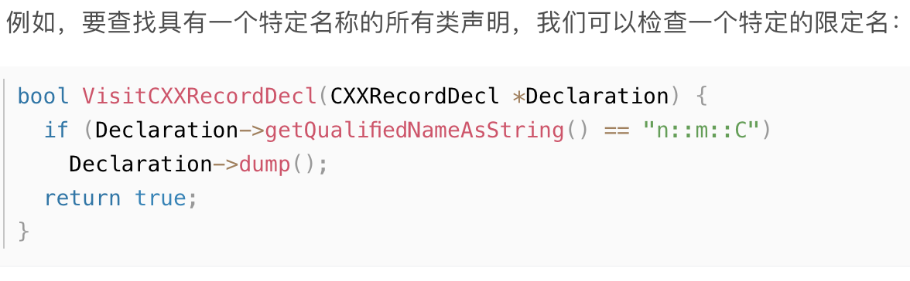
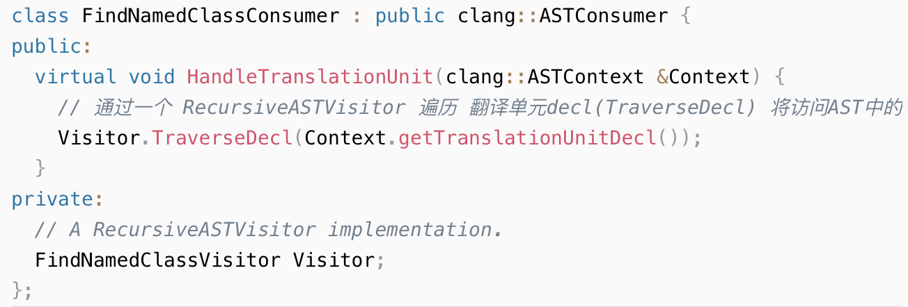

# Astfrontendaction+recursiveastvisitor
- recursiveastvisitor 
    - 根据要访问的代码属于的节点类型来实现相应的函数，例：实现对CXXRecordDecl类型节点的操作，去实现VisitCXXRecordDecl函数即可
    - RecursiveASTVisitor为大多数节点提供了bool VisitNodeType(NodeType *)形式的 hooks，只要实现相关节点类型的方法即可。
      - 例：访问所有CXXRecordDecl
        -   
        -   

- FrontendAction 创建
  - FrontendAction介绍
    - FrontendAction 是一个接口，允许用户指定的actions作为编译的一部分来执行。
    - AST clang提供了接口 AstFrontendAction负责执行action
  - ASTConsumer
    - 介绍
      - 这是一个用于在AST上编写通用actions的接口，它忽略ast的生成方式。
      - ASTConsumer提供了许多不同的入口点。如`HandleTranslationUnit`是用ASTContext为翻译单元调用的：
          
- 访问SourceManager,ASTContext 
  - AST的部分信息是不会存在节点中的，如源文件位置和全局标识符信息（这些信息存在ASTContext 和相关的源文件管理器中），需要将ASTContext 提交到RecursiveASTVistor实现中才能对其检索
  - ASTContext 可以在调用CreateASTConsumer时从CompilerInstance处获得，注意在对应的consumer的实现处重写构造函数使visitor能收到这个ASTContext   
  
