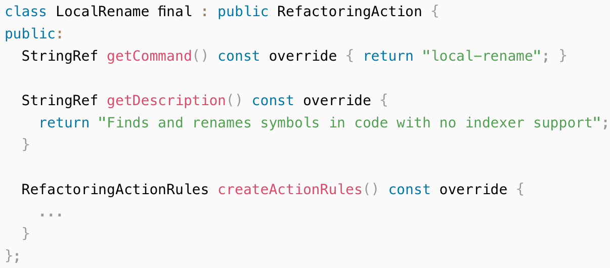
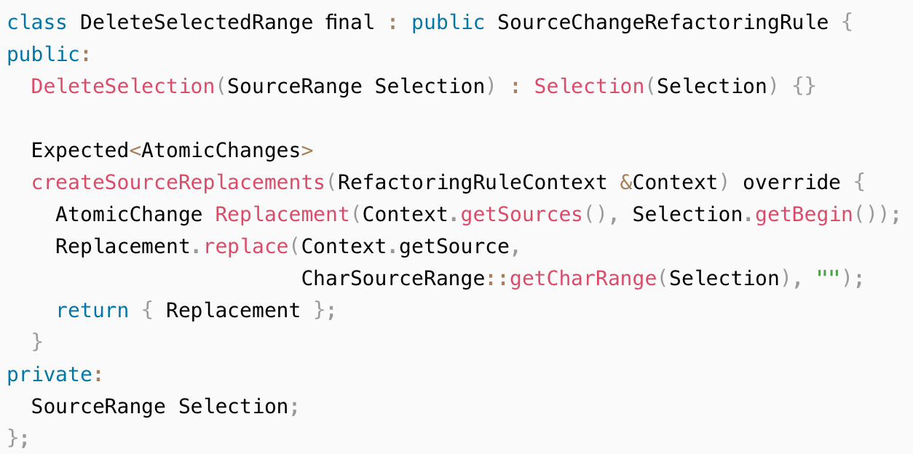
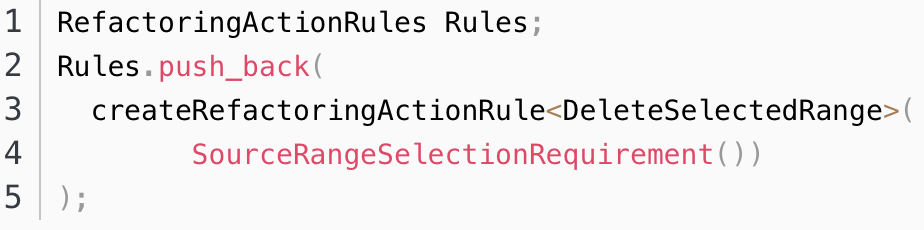

- 原理
  - clang重构引擎定义了一组重构操作用于实现源文件转换
  - clang-refactor命令行工具使用这些重构来完成源源转换
  - 一个重构操作：
    - 它是一个类，定义了一系列相关的重构操作（也称为规则`Rule`）
    - 规则被分组在一个公共的保护伞----一个`clang-refactor`命令
    - 除了规则外，重构操作还向`clang-refactor`提供操作的名称和描述
    - 一个操作必须实现`RefacotrAction`接口
  - 例：一个local-rename操作：
    -   
  - 重构操作规则
    - 一个单独的重构操作负责创建一组分组重构操作规则（rule）
    - 一个规则表示一次重构运算
  - 规则类型：
    - clang的重构引擎支持不同的重构规则
    - `SourceChangeRefactoringRule`
      - 生成用于源文件的源代码替换
      - 选择此规则，子类必须实现`createSourceReplacements`成员函数
      - 此类型的规则用于实现只在一个翻译单元中转换源代码的本地重构
    - `FindSymbolOccurrencesRefactoringRule`生成一个“部分重构”的结果：一组引用特定符号的事件（`occurrences`）
      - 此类型的规则用于实现交互式`renaming action`
        - `renaming action`允许用户指定在重构期间应该重命名的事件
        - 实现此规则的子类必须实现`findSymbolOccurrences`成员函数
  - 创建规则
    - 例：  
  - 使用规则
    - 使用`createRefactoringActionRule`函数将该规则的子类添加到`refactoring action` 的规则列表中，用于一个特定action： 
      
