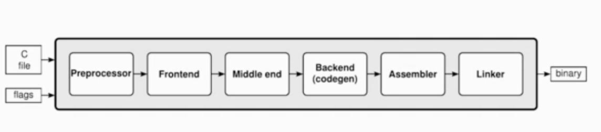

- clang is a compiler driver
    - gets credit/blame for work actually done by [[llvm]]
    - driving all phases of a compiler invocation
    - setting flags for current build/installation (e.g path to include files)
- clang is a c language family frontend
    - compiling c-like code to `LLVM IR`
- Compiler driver phases
    -   
    - preprocessor: does all the macro expansion:file handling, ...
    - 常用指令：
      - clang -ccc-print-phases xxx.c 打印流程
      - clang -### xxx.c 打印流程的相关信息

- clang as language frontend
    - compiling C-like code to LLVM IR
      - 提供有用的诊断信息
      - 支持多种语言和标准
      - 为debug信息记录资源位置
      - 提供很多其他工具的基础（语法高亮，代码补全，静态分析,...）
- Core components of Clang
    - clang实现 Preprocessor->Frontend 部分
      - Preprocessor & Lexer(词法分析) --`Tokens` 
        - 将输入的程序转化为tokens 串
        - 在词法分析的同时会同时做preprocessing
        - 支持tentative parsing(试探性分析)
        - 关键指令:
          - clang -c -Xclang -dump-tokens xxx.c 打印tokens信息
      - Parser（语法分析） --> Sema（语义分析） -->`AST`
        - Handwritten recursice-descent Parser
        - Tentative parsing by looking at the tokens ahead 
        - Tries to recover from errors to parse as much as possible(and suggest fix-in hints)
      - AST 
        - 
        - 常用指令： clang -c -Xclang -ast-dump xxx.c

      - CodeGen -- `LLVM IR` 
        - 和`LLVM` 的`CodeGen`不同，clang的`CodeGen` 产生的是LLVM IR
        - 使用 `AST visitors`, `IRBuilder`, `TargetInfo` 等类
        - CodeGenMoudle 类保存全局状态（e.g:`LLVM type cache`）
        - 常用指令：clang -S -emit-llvm -o xxx.c

[//begin]: # "Autogenerated link references for markdown compatibility"
[llvm]: llvm.md "llvm"
[//end]: # "Autogenerated link references"