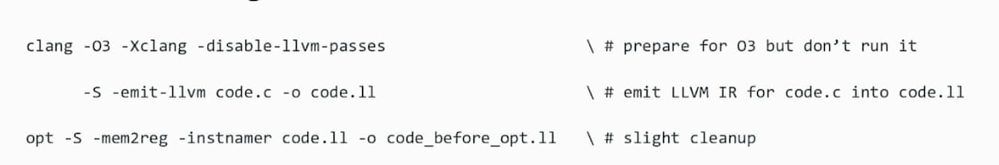

- `llvm-project`  结构：
    - llvm-project/clang  see:[[clang]]
    - llvm-project/llvm   this note
    - ...
- process of compiling and what llvm does during the process:
    `file.cpp`--- [[clang]] --->`LLVM IR`--- llc --->`LLVM MIR(machine IR)`--- llc  
- CFG(Control Flow Graph):
  - C program -> LLVM-IR:
    -   
      - -S  给一个可读的IR（人类语言）
      - 产生一个module：
        - datalayout:module 的数据布局
    - IR效果：
      -   
    - `LLVM-IR` 结构：
      - llvm:Module： list of global symbols
        - llvm:GlobalVariable（全局变量）
        - llvm:Function（函数 ）:list of basic blocks that form a `CFG`
          - llvm:BasicBlock（基本快[[basicblock]]，以入口开始，出口结束）:list of instructions,terminated by a `branch`（[[branch]]）/`return`/...
            - llvm::Instruction（指令）:typed assembly instruction with operands(操作数)
                  - llvm:ICmplnst(整形cmp)
                  - llvm:BranchInst(分支指令)
    - `LLVM-IR`为`SSA` form(Static Single Assignment form,静态单赋值形式)
    -变量开头
      - 全局变量以`@`开头
      - 局部变量以`%`开头
      - `basic block` 被调用处以`%`开头
      - `basic block` 定义处以`.`开头
    - 常见误区
      - 控制流 可能是不可约的，不可约流图（[[Loop]]）不会被识别
      - 只有可达的LLVM-IR是SSA的，不可达代码段不会被处理做格式规范
      - 地址空间是指针类型的一部分（不可忽视）
      - null是一个合法指针，即使在0号地址
      - llvm项目不区分有符号和无符号
  - `CodeGen` and `Targets`:
    - `CodeGen`:
       - 
    - `Targets`:
       -   
       - `TargetMachine`包括了Module 更低层级别的
    

 
[//begin]: # "Autogenerated link references for markdown compatibility"
[clang]: clang.md "clang"
[basicblock]: basicblock.md "BasicBlock"
[branch]: branch.md "Branch"
[Loop]: loop.md "Loop"
[//end]: # "Autogenerated link references"
