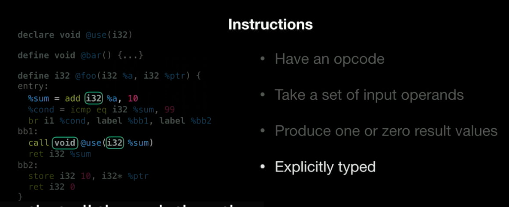
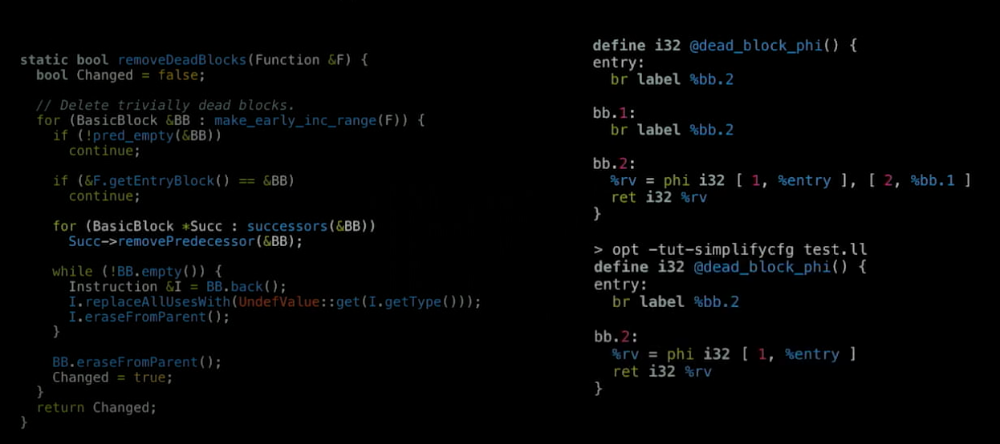
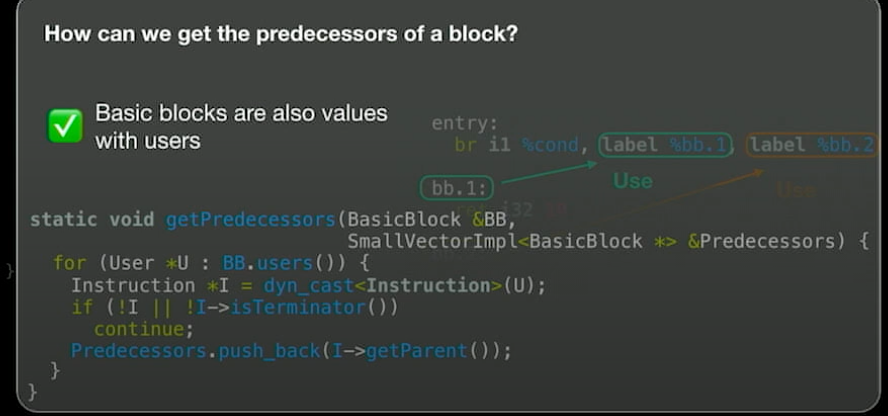
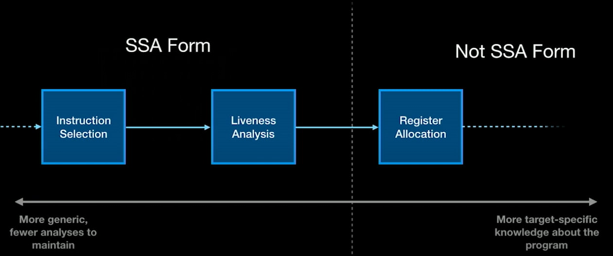

# Llvm:basic
- `LLVM IR`:generic assembly language 
  - 结构：
  - 基本元素：
    - opcode：指示对应的指令
    - operand： 操作数
    - 结果值
    - 明确的类型
    - e.g:  
  - 指令：
    - 算术指令：Arithmetic instructions
    - 比较指令：Compare instructions
    - 控制流指令：Control Flow instructions
    - 调用指令：Call instructions
    - 存取指令：Load/Stores instructions
  - [[basicblock]]:list of instructions
  - 函数：
    -has name & type signature
    - list of [[basicblock]]
      - 1st `block`:entry blcok
  - 模块：module
    - Top-level container of a program containing
    - 组成:
      - functions
      - declarations
      - global variables
  - instructions User uses:
    - 指令的结果值被`identifier`引用，`identifier`不是变量！
  - LLVM IR三种形式
    - .ll：textual
      - 可读性强
      - 可以写pass debug
    - .bc: bitcode
      - 存储效率高
      - 向下兼容
    - In-Memory:
      - 以对象形式表示
      - 与c/c++互相作用完成转换
- LLVM IR 实例：dead blcok remove
  - 代码：  

  - how to get predecessors of a block：
    - basic blocks are also values with users(可以在调用出检测到basic blcok是否被使用过)
    - 函数：  

- Code Gen Passes(back end passes)
  - 在指令选择之后运行
  - 不以IR为作用对象，以MIR为对象
  - 流程： IR --`Instruction Selection1`-->(where code gen works)MIR--`Assembly Printer`-->Assembly
  - 虚拟寄存器：%+数字
  - 物理寄存器：
  -   
  - TargetInstrInfo:描述被使用的指令
  - 使用llc来检查结果

[//begin]: # "Autogenerated link references for markdown compatibility"
[basicblock]: basicblock.md "BasicBlock"
[//end]: # "Autogenerated link references"